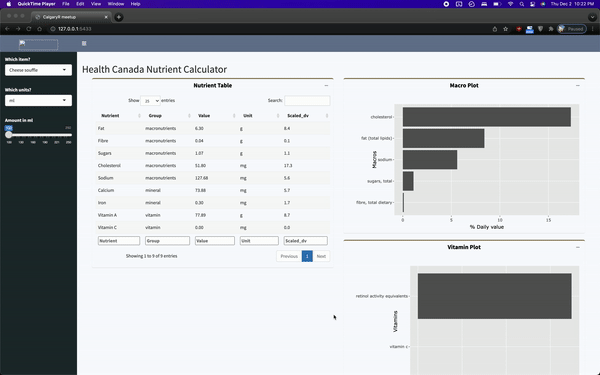

### Options for styling your Shiny app

There are a whole host of options for styling your Shiny applications. The main app.R file shows an unstyled app that's trying to do too much at a time. I tried to provide a couple examples of apps that use different approaches. The first example called [app_JDA.R](app_JDA.R) uses a combination of the shinydashboard package for the layout and a linked css file for styling. The [second example](app_BSlib.R) uses regular ol' Shiny for layout and bslib for styling. I'm not terribily familiar with bslib, but I came away impressed with how easily it can change the look of an app. The biggest downside to bslib (for me) is that it is not compatible with shinydashboard.

Here's a quick list of packages that you can use for styling and layout.

- [shinydashboard](https://rstudio.github.io/shinydashboard/)
- [flexdashboard](https://pkgs.rstudio.com/flexdashboard/)
- [bslib](https://rstudio.github.io/bslib/)
- [fresh](https://github.com/dreamRs/fresh)
- [base Shiny documentation](https://shiny.rstudio.com/articles/layout-guide.html)

### How to write your own CSS for your app
When you're pretty new to web development like I am, it can be pretty time consuming to contruct the styling your looking for with pure css. I usually use the inspector tools in web browsers to look at an element I'm interested in styling. I'll try out a bunch of colors and styles directly in the browser and when I'm happy with the look of that element, I'll add it to my css file. I'm sure there are more efficient ways to go about this, but this is the way that I have done my styling thus far!

### More reading

[This website](https://unleash-shiny.rinterface.com/index.html) is an excellent resource for styling and layout. I was truly blown away with what they demonstrate is possible for visual customization of applications. 
