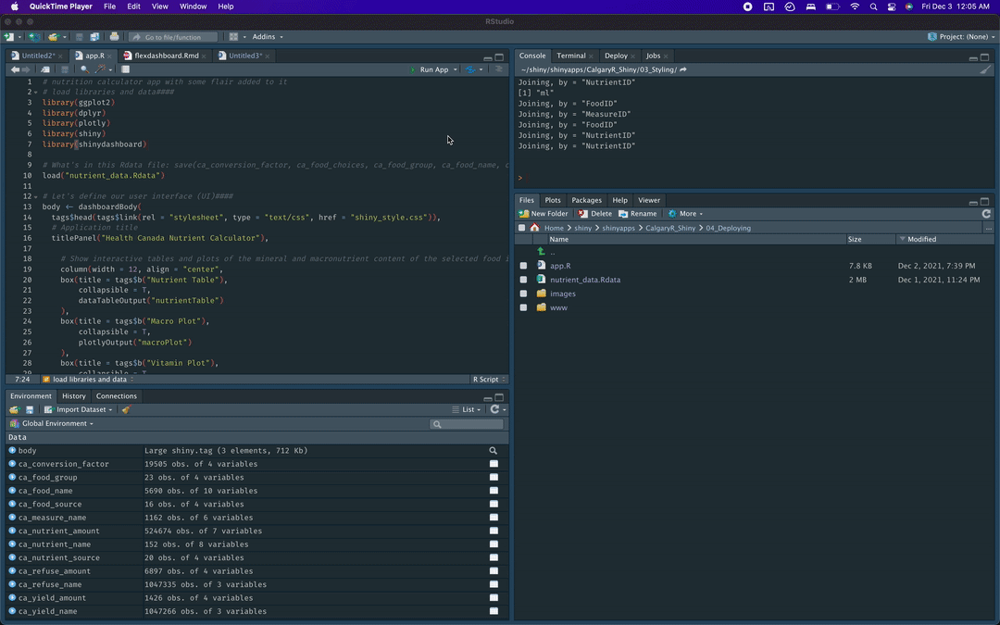

### Deploying your Shiny app with shinyapps.io

The simplest way to deploy an app is to use the tools that Rstudio has built in. You can deploy and host (simple) applications for free with [shinyapps.io](https://shinyapps.io). You'll need to create an account first, but once you do that, you can deploy from within Rstudio. Rstudio will guide you on connecting your shinyapps.io account with your session. From there, deploying and updating existing apps are basically just a couple of button clicks away. The free tier for this service is limited--so you won't be able to run anything huge or have tons of users simultaneously, but you can pay to scale shinyapps.io to your needs. You can also pay to direct your shiny app to a custom domain name!

Here's a sped up example of what it looks like when I update my already deployed (and still not great looking) application:



Shinyapps.io does all the work for us in spinning up a virtual machine and installing the packages that you call in the app. It's pretty seamless!

***
### Building your own Shiny server with Docker

If you want more control over your deployments of Shiny apps, you can always build your own shiny server with tools like Docker and host it yourself using a service like AWS. I don't intend on covering this in the first CalgaryR Shiny workshop, but I'm leaving it here for the curious. Install docker [here](https://docs.docker.com/get-docker/).

I wrote a dockerfile that installs an ubuntu based shiny server instance and runs this whole repo at localhost:3838. The dockerfile is a really simple instruction set for building your desired environment. I'm basically just telling Docker to build off the existing shinyserver docker image--adding Ubuntu libraries that I've found necessary for some of these R package installs, installing the R packages needed for the individual Shiny apps, and giving the server the correct permissions to run. You could presumably run this docker container on a virtual machine using EC2, Amazon's VM service. **Note: This build shouldn't really be used for actual deployments because it doesn't use a reverse proxy. It's really meant just for instructional purposes.**  

Here's how to build the image:
```bash
docker build -t shinies 04_Deploying/
```
and here's how to run the image in a container, linking your local repo to the right directory in the server build:

```bash
docker run -p 3838:3838 -v ~/shiny/shinyapps/CalgaryR_Shiny/:/srv/shiny-server/ shinies
```
You'll have to change your directory to the location of the repo on your personal computer.
